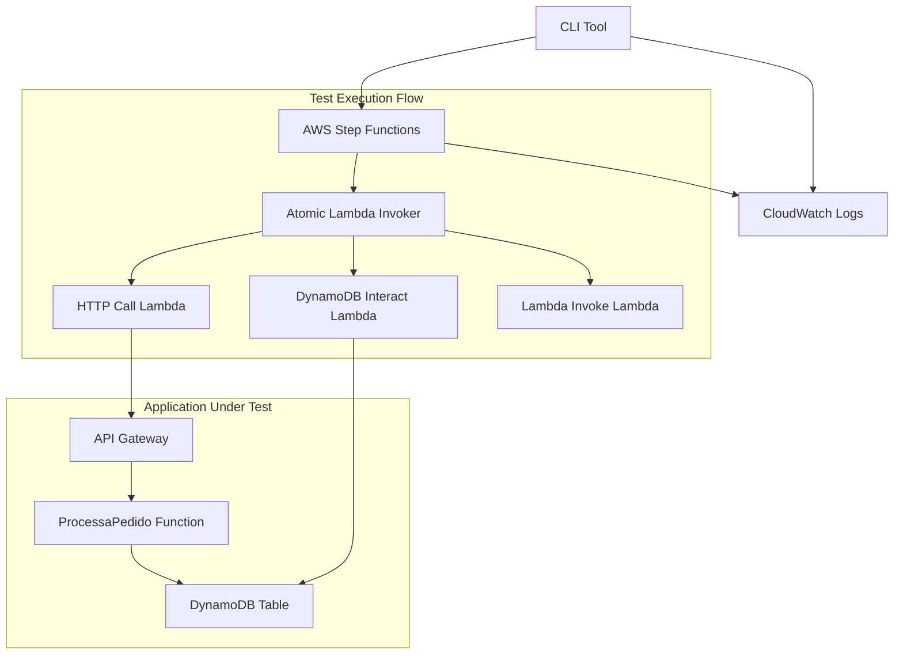
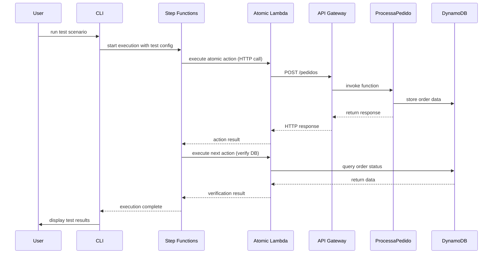
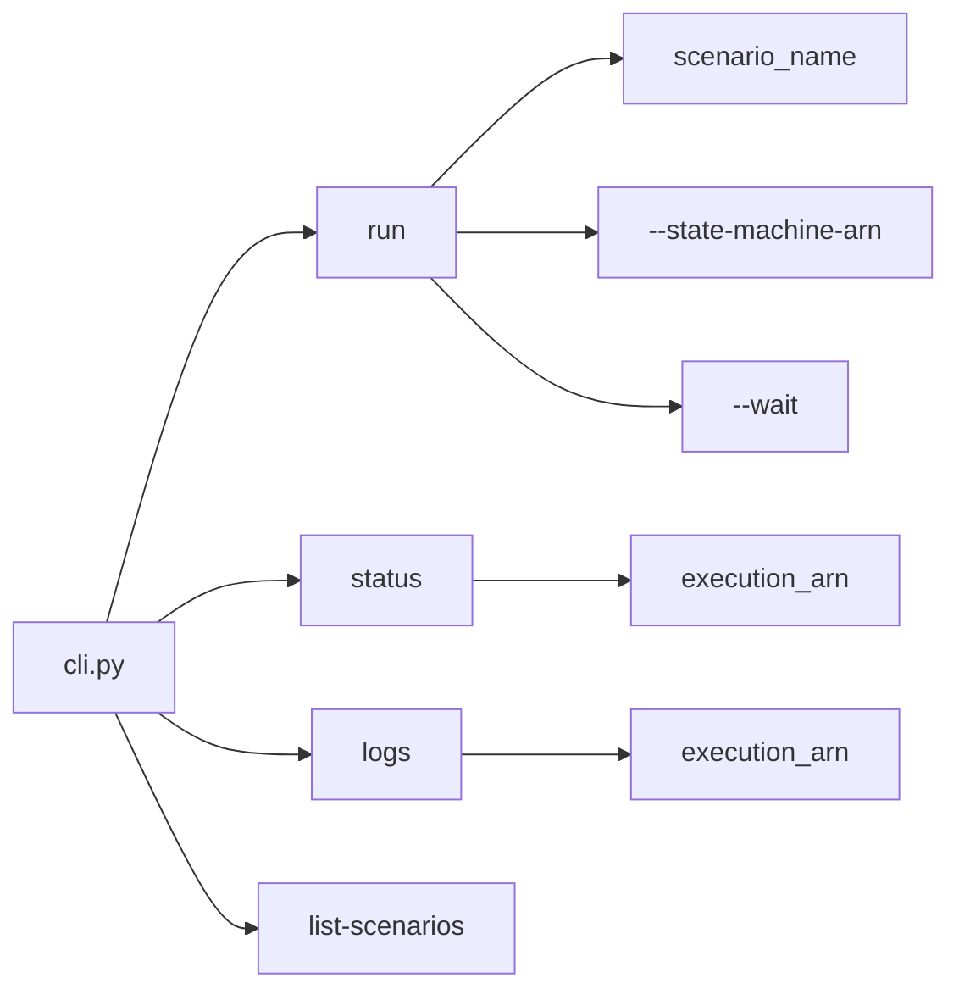
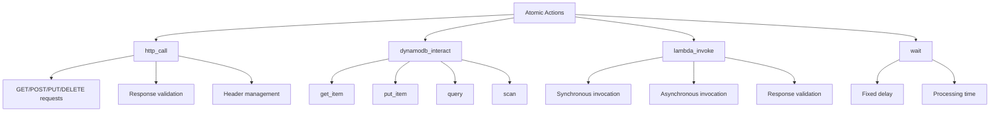
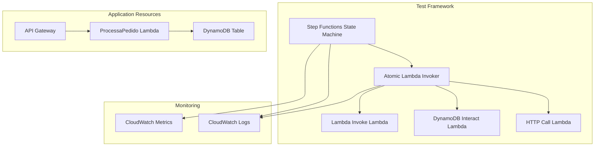
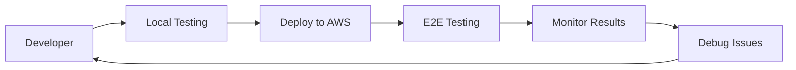

# AWS Integration Tests CLI

A command-line interface for orchestrating End-to-End (E2E) tests on AWS microservices using AWS Step Functions.

## Table of Contents

- [Overview](#overview)
- [Architecture](#architecture)
- [Features](#features)
- [Installation](#installation)
- [Usage](#usage)
- [Test Scenarios](#test-scenarios)
- [Project Structure](#project-structure)
- [AWS Resources](#aws-resources)
- [Development](#development)
- [Contributing](#contributing)

## Overview

This CLI tool provides a framework for running automated integration tests across AWS microservices. It leverages AWS Step Functions to orchestrate test workflows and provides a simple command-line interface to execute, monitor, and analyze test results.

## Architecture

### High-Level Architecture



### Test Execution Flow



## Features

- **Test Orchestration**: Execute complex E2E test scenarios using AWS Step Functions
- **Atomic Actions**: Modular test actions including HTTP calls, DynamoDB interactions, and Lambda invocations
- **Real-time Monitoring**: Monitor test execution progress with status updates
- **Detailed Logging**: Comprehensive logging with execution history and CloudWatch integration
- **Scenario Management**: JSON-based test scenario definitions with reusable configurations
- **CLI Interface**: Simple command-line tools for test execution and management

## Installation

### Prerequisites

- Python 3.8 or higher
- AWS CLI configured with appropriate permissions
- AWS SAM CLI (for deployment)

### Setup

1. Clone the repository:
```bash
git clone <repository-url>
cd IF1009-AWS-Integration-Tests-CLI
```

2. Install dependencies:
```bash
pip install -r requirements.txt
```

3. Configure AWS credentials:
```bash
aws configure
```

4. Deploy AWS resources:
```bash
sam build
sam deploy --guided
```

## Usage

### Basic Commands

#### Run a Test Scenario
```bash
python cli.py run <scenario_name> --state-machine-arn <arn>
```

#### Check Test Status
```bash
python cli.py status <execution_arn>
```

#### View Test Logs
```bash
python cli.py logs <execution_arn>
```

#### List Available Scenarios
```bash
python cli.py list-scenarios
```

### Command Options



### Example Usage

1. **List available test scenarios:**
```bash
python cli.py list-scenarios
```

2. **Run a test scenario:**
```bash
python cli.py run pedido_valido_sucesso \
  --state-machine-arn arn:aws:states:us-east-1:123456789012:stateMachine:TestFramework \
  --wait
```

3. **Check execution status:**
```bash
python cli.py status arn:aws:states:us-east-1:123456789012:execution:TestFramework:execution-name
```

4. **View detailed logs:**
```bash
python cli.py logs arn:aws:states:us-east-1:123456789012:execution:TestFramework:execution-name
```

## Test Scenarios

Test scenarios are defined as JSON files in the `tests/` directory. Each scenario contains a sequence of atomic actions to be executed.

### Scenario Structure

```json
{
  "scenarioName": "GenericPedidoTest",
  "description": "Creates an order via API and verifies its status in DynamoDB",
  "actions": [
    {
      "name": "CreateOrderHTTPCall",
      "type": "http_call",
      "params": {
        "url": "YOUR_API_GATEWAY_ENDPOINT",
        "method": "POST",
        "headers": {
          "Content-Type": "application/json"
        },
        "body": {
          "item": "Product Name",
          "quantidade": 1
        },
        "expectedStatusCode": 200
      }
    }
  ]
}
```

### Atomic Action Types



## Project Structure

```
├── cli.py                          # Main CLI application
├── requirements.txt                # Python dependencies
├── template.yaml                   # SAM template for AWS resources
├── samconfig.toml                  # SAM configuration
├── cli_debug.log                   # CLI debug logs
├── definition/
│   └── order_e2e_test_flow.asl.json  # Step Functions definition
├── src/
│   ├── atomic_test_lambdas/        # Atomic test lambda functions
│   │   ├── atomic_lambda_invoker.py
│   │   ├── dynamodb_interact.py
│   │   ├── http_call.py
│   │   └── lambda_invoke.py
│   └── processa_pedido/            # Application under test
│       └── app.py
└── tests/
    └── pedido_valido_sucesso.json  # Test scenario definitions
```

### File Descriptions

| File/Directory | Description |
|----------------|-------------|
| `cli.py` | Main CLI application with commands for test execution |
| `template.yaml` | AWS SAM template defining infrastructure resources |
| `definition/` | Contains Step Functions state machine definitions |
| `src/atomic_test_lambdas/` | Lambda functions for executing atomic test actions |
| `src/processa_pedido/` | Sample application under test |
| `tests/` | Test scenario JSON configuration files |

## AWS Resources

The project creates the following AWS resources:

### Core Resources



### Resource Details

| Resource Type | Name | Purpose |
|---------------|------|---------|
| Step Functions | `E2ETestFramework-GenericE2ETestFlow` | Orchestrates test execution |
| Lambda Function | `AtomicLambdaInvoker` | Executes atomic test actions |
| Lambda Function | `ProcessaPedido` | Sample application function |
| DynamoDB Table | `Pedidos` | Sample application data store |
| API Gateway | `PedidoApi` | REST API for the sample application |

## Development

### Adding New Test Scenarios

1. Create a new JSON file in the `tests/` directory
2. Define the scenario structure with actions array
3. Use available atomic action types or create new ones
4. Test the scenario using the CLI

### Creating New Atomic Actions

1. Add implementation in appropriate lambda file in `src/atomic_test_lambdas/`
2. Update the `atomic_lambda_invoker.py` to handle the new action type
3. Document the action parameters and expected behavior

### Local Development

```bash
# Install development dependencies
pip install -r requirements.txt

# Run tests locally
python cli.py list-scenarios

# Deploy to AWS for testing
sam build && sam deploy
```

### Testing the CLI



## Contributing

1. Fork the repository
2. Create a feature branch
3. Make changes and add tests
4. Submit a pull request

### Code Style

- Follow PEP 8 for Python code
- Use meaningful variable and function names
- Add docstrings for functions and classes
- Include error handling and logging

## License

This project is licensed under the MIT License - see the LICENSE file for details.

## Support

For questions or issues, please:
1. Check the documentation
2. Review CloudWatch logs for detailed error information
3. Create an issue in the repository
4. Contact the development team

---

*This documentation is maintained as part of the AWS Integration Tests CLI project.*
