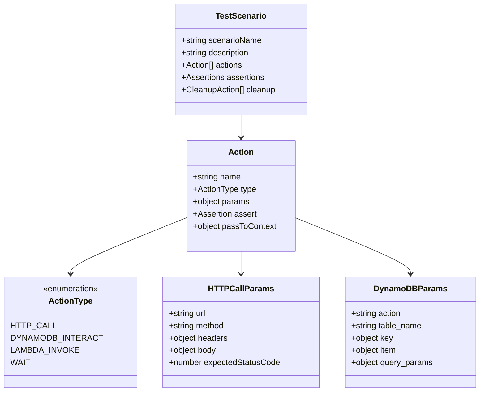
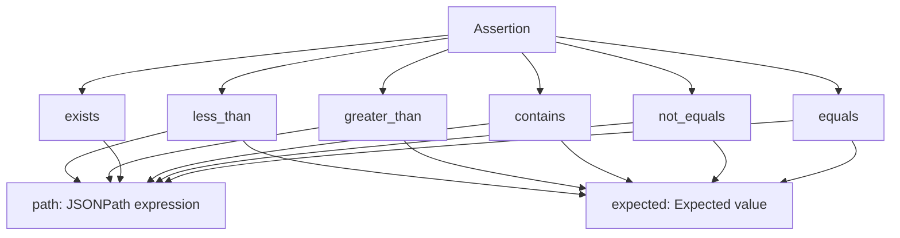

# API Reference

## CLI Commands

### `run`

Executes a test scenario using AWS Step Functions.

#### Syntax
```bash
python cli.py run <scenario_name> --state-machine-arn <arn> [--wait]
```

#### Parameters

| Parameter | Type | Required | Description |
|-----------|------|----------|-------------|
| `scenario_name` | string | Yes | Name of the test scenario JSON file (without .json extension) |
| `--state-machine-arn` | string | Yes | ARN of the Step Functions state machine |
| `--wait` | flag | No | Wait for test completion and show results (default: true) |

#### Examples

```bash
# Run a test scenario and wait for completion
python cli.py run pedido_valido_sucesso \
  --state-machine-arn arn:aws:states:us-east-1:123456789012:stateMachine:TestFramework \
  --wait

# Run a test scenario without waiting
python cli.py run pedido_valido_sucesso \
  --state-machine-arn arn:aws:states:us-east-1:123456789012:stateMachine:TestFramework
```

#### Response

**Success Response:**
```
--- Teste E2E Iniciado ---
Cenário: pedido_valido_sucesso
ID da Execução do Teste: 12345678-1234-1234-1234-123456789012
ARN da Execução da Step Functions: arn:aws:states:us-east-1:123456789012:execution:TestFramework:execution-name
---------------------------

Status: RUNNING |
Status: SUCCEEDED

--- Resultados do Teste: pedido_valido_sucesso ---
Execução: arn:aws:states:us-east-1:123456789012:execution:TestFramework:execution-name
Resultado: PASSOU ✅
Output da Step Functions: {
  "testRunId": "12345678-1234-1234-1234-123456789012",
  "status": "PASSED",
  "results": {...}
}
```

**Error Response:**
```
--- Resultados do Teste: pedido_valido_sucesso ---
Resultado: FALHOU ❌
Causa: Task failed with error
Erro: Lambda function returned error
```

---

### `status`

Checks the status of a test execution.

#### Syntax
```bash
python cli.py status <execution_arn>
```

#### Parameters

| Parameter | Type | Required | Description |
|-----------|------|----------|-------------|
| `execution_arn` | string | Yes | ARN of the Step Functions execution |

#### Examples

```bash
python cli.py status arn:aws:states:us-east-1:123456789012:execution:TestFramework:execution-name
```

#### Response

```
--- Status da Execução ---
ARN: arn:aws:states:us-east-1:123456789012:execution:TestFramework:execution-name
Status: SUCCEEDED
Data de Início: 2023-07-22 10:30:00
Data de Fim: 2023-07-22 10:32:15
Ver console AWS para detalhes: https://console.aws.amazon.com/states/home?#/executions/details/...
---------------------------
```

---

### `logs`

Retrieves detailed execution logs from Step Functions history.

#### Syntax
```bash
python cli.py logs <execution_arn>
```

#### Parameters

| Parameter | Type | Required | Description |
|-----------|------|----------|-------------|
| `execution_arn` | string | Yes | ARN of the Step Functions execution |

#### Examples

```bash
python cli.py logs arn:aws:states:us-east-1:123456789012:execution:TestFramework:execution-name
```

#### Response

```
--- Histórico de Logs da Execução: arn:aws:states:... ---
[2023-07-22 10:30:00] [1] ExecutionStarted
[2023-07-22 10:30:01] [2] StateEntered - Entrou no estado: PrepareAndExecuteActions
[2023-07-22 10:30:02] [3] TaskStateEntered - Entrou no estado: ExecuteAtomicAction
[2023-07-22 10:30:05] [4] LambdaFunctionSucceeded
  Output da Lambda: {
    "status": "SUCCESS",
    "result": {...}
  }
[2023-07-22 10:30:06] [5] StateExited - Saiu do estado: ExecuteAtomicAction
```

---

### `list-scenarios`

Lists all available test scenarios.

#### Syntax
```bash
python cli.py list-scenarios
```

#### Parameters

None.

#### Examples

```bash
python cli.py list-scenarios
```

#### Response

```
Cenários de teste disponíveis:
- pedido_valido_sucesso
- pedido_invalido_erro
- teste_performance
```

---

## Test Scenario JSON Schema

### Schema Overview

Test scenarios are defined as JSON files with the following structure:

```json
{
  "scenarioName": "string",
  "description": "string",
  "actions": [
    {
      "name": "string",
      "type": "string",
      "params": {},
      "assert": {},
      "passToContext": {}
    }
  ],
  "assertions": {},
  "cleanup": []
}
```

### Schema Definition



### Action Types

#### HTTP Call Action

Performs HTTP requests to REST APIs.

```json
{
  "name": "CreateOrderHTTPCall",
  "type": "http_call",
  "params": {
    "url": "https://api.example.com/orders",
    "method": "POST",
    "headers": {
      "Content-Type": "application/json",
      "Authorization": "Bearer token"
    },
    "body": {
      "item": "Product",
      "quantity": 1
    },
    "expectedStatusCode": 200
  },
  "passToContext": {
    "orderId": "$.response.body.orderId",
    "timestamp": "$.response.body.timestamp"
  }
}
```

**Parameters:**

| Parameter | Type | Required | Description |
|-----------|------|----------|-------------|
| `url` | string | Yes | Target URL for the HTTP request |
| `method` | string | Yes | HTTP method (GET, POST, PUT, DELETE, etc.) |
| `headers` | object | No | HTTP headers to include |
| `body` | object | No | Request body for POST/PUT requests |
| `expectedStatusCode` | number | No | Expected HTTP status code (default: 200) |

#### DynamoDB Interact Action

Performs operations on DynamoDB tables.

```json
{
  "name": "VerifyOrderInDB",
  "type": "dynamodb_interact",
  "params": {
    "action": "get_item",
    "table_name": "Orders",
    "key": {
      "orderId": "12345",
      "timestamp": "2023-07-22T10:30:00Z"
    }
  },
  "assert": {
    "type": "equals",
    "path": "$.item.status",
    "expected": "PROCESSING"
  }
}
```

**Parameters:**

| Parameter | Type | Required | Description |
|-----------|------|----------|-------------|
| `action` | string | Yes | DynamoDB operation (get_item, put_item, query, scan) |
| `table_name` | string | Yes | Name of the DynamoDB table |
| `key` | object | Conditional | Primary key for get_item/put_item operations |
| `item` | object | Conditional | Item data for put_item operations |
| `query_params` | object | Conditional | Query parameters for query/scan operations |

#### Lambda Invoke Action

Invokes AWS Lambda functions.

```json
{
  "name": "ProcessOrder",
  "type": "lambda_invoke",
  "params": {
    "function_name": "order-processor",
    "invocation_type": "RequestResponse",
    "payload": {
      "orderId": "12345",
      "action": "process"
    }
  },
  "assert": {
    "type": "equals",
    "path": "$.response.statusCode",
    "expected": 200
  }
}
```

**Parameters:**

| Parameter | Type | Required | Description |
|-----------|------|----------|-------------|
| `function_name` | string | Yes | Name or ARN of the Lambda function |
| `invocation_type` | string | No | Invocation type (RequestResponse, Event) |
| `payload` | object | No | Payload to send to the function |

#### Wait Action

Introduces delays in test execution.

```json
{
  "name": "WaitForProcessing",
  "type": "wait",
  "params": {
    "seconds": 30
  }
}
```

**Parameters:**

| Parameter | Type | Required | Description |
|-----------|------|----------|-------------|
| `seconds` | number | Yes | Number of seconds to wait |

### Assertions

Assertions validate the results of actions.

#### Assertion Types



#### Assertion Examples

**Equals Assertion:**
```json
{
  "assert": {
    "type": "equals",
    "path": "$.response.status",
    "expected": "success"
  }
}
```

**Contains Assertion:**
```json
{
  "assert": {
    "type": "contains",
    "path": "$.response.items",
    "expected": "order-123"
  }
}
```

**Exists Assertion:**
```json
{
  "assert": {
    "type": "exists",
    "path": "$.response.orderId"
  }
}
```

### Context Passing

Actions can pass data to subsequent actions using JSONPath expressions.

```json
{
  "passToContext": {
    "orderId": "$.response.body.orderId",
    "timestamp": "$.response.headers.timestamp",
    "status": "$.response.body.status"
  }
}
```

Context data can be referenced in later actions:

```json
{
  "params": {
    "key": {
      "orderId": "{{context.orderId}}",
      "timestamp": "{{context.timestamp}}"
    }
  }
}
```

## Error Codes

### CLI Error Codes

| Code | Message | Description |
|------|---------|-------------|
| `SCENARIO_NOT_FOUND` | Cenário de teste não encontrado | The specified test scenario file doesn't exist |
| `INVALID_JSON` | JSON inválido | The scenario file contains invalid JSON |
| `AWS_ERROR` | Erro AWS | Generic AWS service error |
| `EXECUTION_NOT_FOUND` | Execução não existe | The specified Step Functions execution doesn't exist |
| `PERMISSION_DENIED` | Acesso negado | Insufficient permissions to perform operation |

### Step Functions Error States

| State | Description | Action |
|-------|-------------|---------|
| `ActionFailed` | An atomic action failed | Check action parameters and target service status |
| `TestFailed` | Overall test failed | Review assertion failures and error logs |
| `Timeout` | Execution timed out | Increase timeout or optimize test actions |

## Rate Limits and Quotas

### AWS Service Limits

| Service | Limit | Impact |
|---------|--------|--------|
| Step Functions | 2,000 executions per second | Concurrent test execution limit |
| Lambda | 1,000 concurrent executions | Atomic action execution limit |
| API Gateway | 10,000 requests per second | HTTP action throughput |
| DynamoDB | 40,000 read/write capacity units | Database action throughput |

### Recommended Practices

1. **Batch Operations**: Group related actions to reduce Step Functions state transitions
2. **Parallel Execution**: Use parallel branches for independent test scenarios
3. **Resource Pooling**: Reuse connections and clients in Lambda functions
4. **Error Handling**: Implement exponential backoff for transient failures
5. **Monitoring**: Set up CloudWatch alarms for error rates and latency

---

This API reference provides comprehensive documentation for all CLI commands, test scenario structures, and configuration options available in the AWS Integration Tests CLI.
