# Architecture Documentation

## System Architecture Overview

The AWS Integration Tests CLI is built on a serverless architecture using AWS Step Functions to orchestrate end-to-end tests across microservices.

## Component Architecture

### 1. CLI Layer
The command-line interface provides user interaction capabilities:

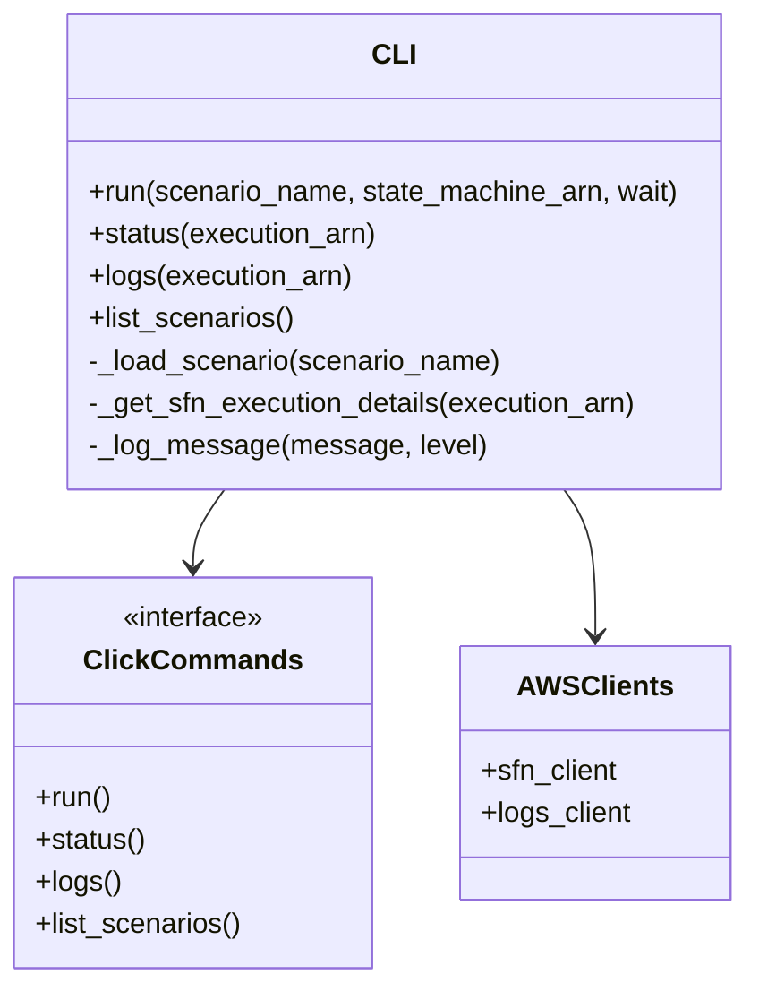

### 2. Test Orchestration Layer

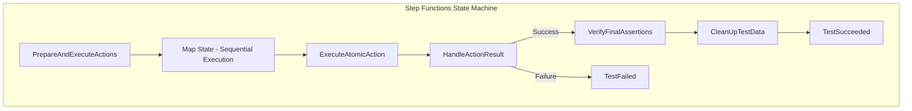

### 3. Atomic Actions Layer

The atomic actions provide modular test capabilities:

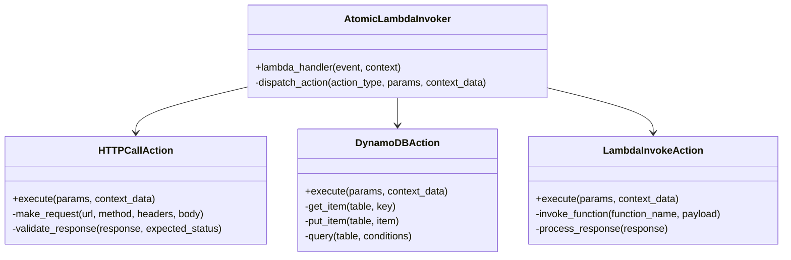

## Data Flow Architecture

### Test Execution Data Flow

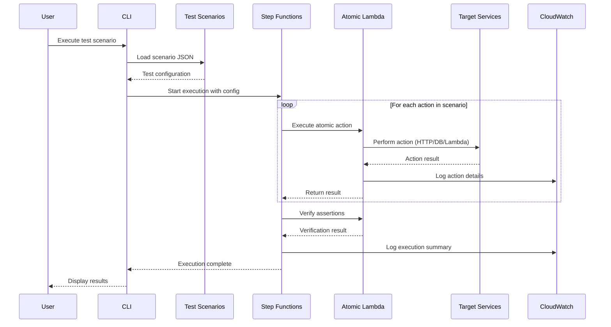

## State Management

### Test Context Flow

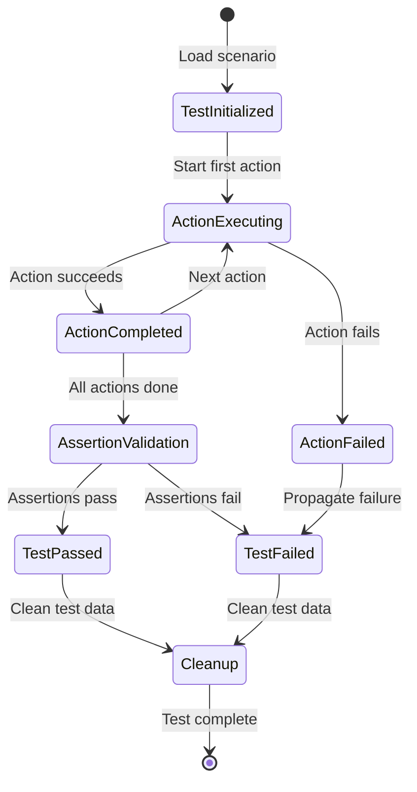

## Security Architecture

### IAM Permissions Model

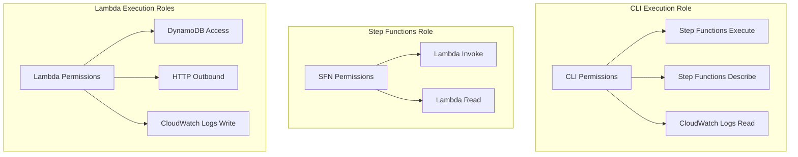

## Scalability Considerations

### Concurrent Test Execution

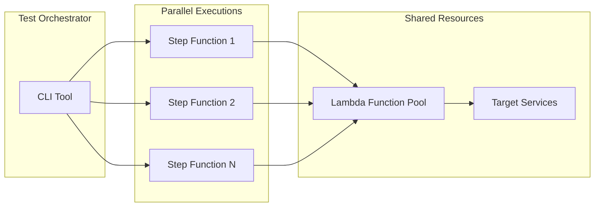

### Resource Limits and Considerations

| Component | Limit | Consideration |
|-----------|--------|---------------|
| Step Functions | 25,000 state transitions | Monitor execution complexity |
| Lambda Concurrent Executions | 1,000 (default) | Request limit increases for high concurrency |
| API Gateway | 10,000 RPS | Consider throttling for load tests |
| DynamoDB | 40,000 RCU/WCU | Scale based on test data requirements |

## Error Handling Architecture

### Error Propagation Flow

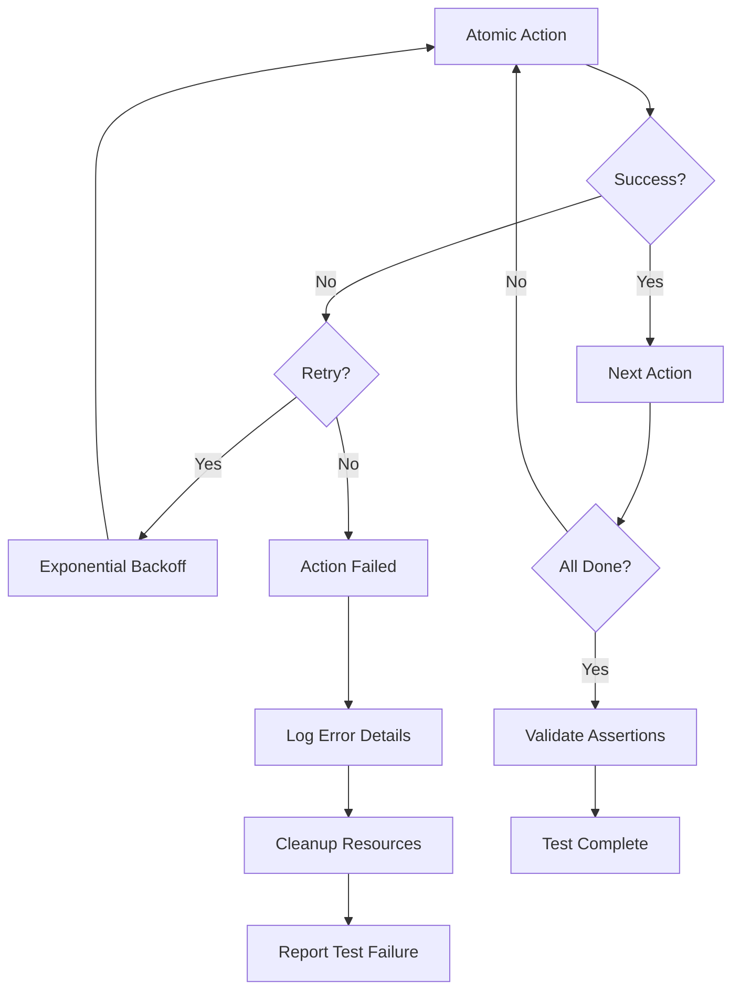

## Monitoring and Observability

### Logging Architecture

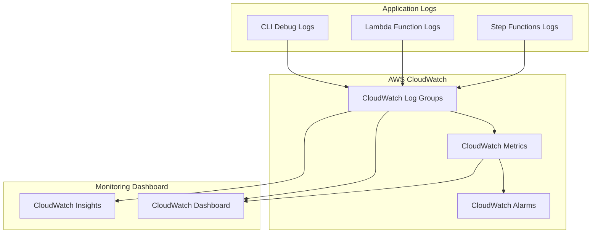

## Performance Architecture

### Test Execution Optimization

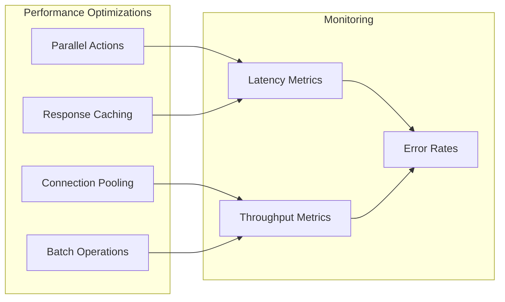

## Deployment Architecture

### CI/CD Pipeline Integration

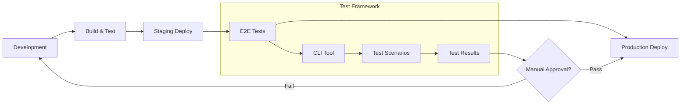

This architecture documentation provides a comprehensive view of how the AWS Integration Tests CLI is structured and how its components interact to provide a robust testing framework for AWS microservices.
