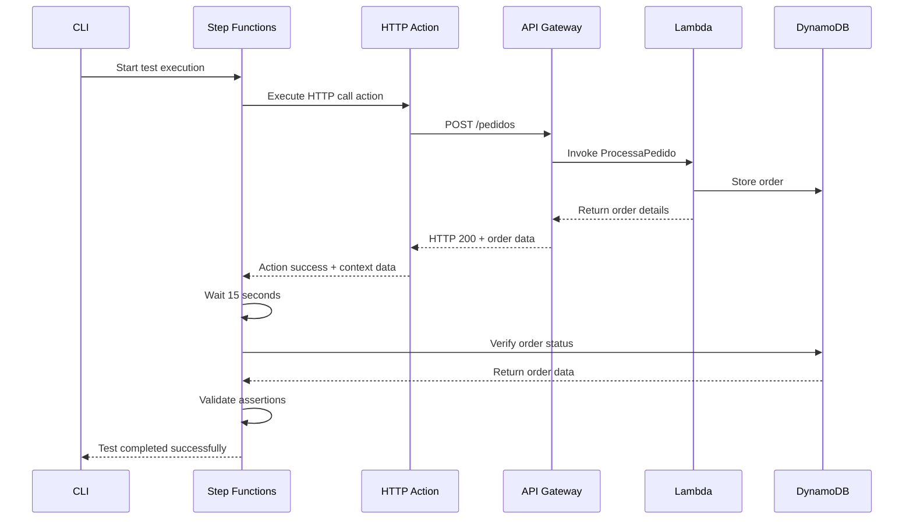
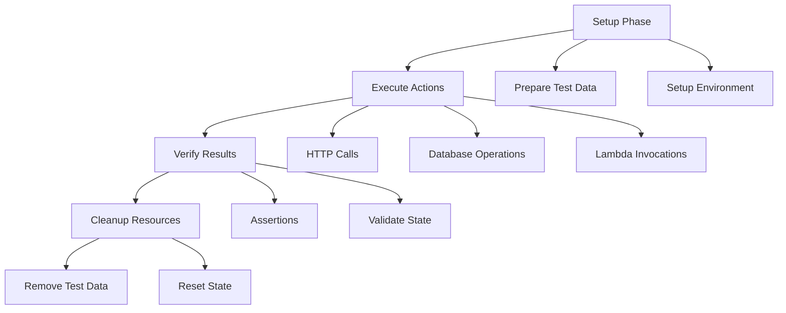

# Getting Started Guide

This guide will help you set up and run your first end-to-end test using the AWS Integration Tests CLI.

## Prerequisites

Before you begin, ensure you have the following:

- **AWS Account**: An active AWS account with appropriate permissions
- **Python 3.8+**: Python runtime environment
- **AWS CLI**: Configured with your credentials
- **AWS SAM CLI**: For deploying serverless applications
- **Git**: For cloning the repository

## Installation

### Step 1: Clone the Repository

```bash
git clone https://github.com/your-org/IF1009-AWS-Integration-Tests-CLI.git
cd IF1009-AWS-Integration-Tests-CLI
```

### Step 2: Set Up Python Environment

```bash
# Create virtual environment (recommended)
python3 -m venv test-cli-env
source test-cli-env/bin/activate  # On Windows: test-cli-env\Scripts\activate

# Install dependencies
pip install -r requirements.txt
```

### Step 3: Configure AWS Credentials

```bash
aws configure
```

Provide your AWS credentials:
- Access Key ID
- Secret Access Key  
- Default region (e.g., `us-east-1`)
- Output format (`json`)

## Deployment

### Step 1: Build the SAM Application

```bash
sam build
```

### Step 2: Deploy to AWS

```bash
sam deploy --guided
```

Follow the prompts to configure your deployment:

```
Stack Name: e2e-test-framework
AWS Region: us-east-1
Parameter ProjectName: MyProject
Parameter TestFrameworkName: MyTestFramework
Confirm changes before deploy: Y
Allow SAM CLI IAM role creation: Y
Save parameters to samconfig.toml: Y
```

### Step 3: Note the Outputs

After deployment, note the important outputs:

```
CloudFormation outputs from deployed stack
-----------------------------------------
Key                 Value
-----------------------------------------
StepFunctionArn     arn:aws:states:us-east-1:123456789012:stateMachine:MyTestFramework-GenericE2ETestFlow
ApiGatewayUrl       https://abcd1234.execute-api.us-east-1.amazonaws.com/prod
DynamoDBTableName   MyProject-Pedidos
-----------------------------------------
```

## Your First Test

### Step 1: Update Test Scenario

Edit the test scenario file to use your deployed resources:

```bash
nano tests/pedido_valido_sucesso.json
```

Update the configuration:

```json
{
  "scenarioName": "GenericPedidoTest",
  "description": "Creates an order via API and verifies its status in DynamoDB",
  "actions": [
    {
      "name": "CreateOrderHTTPCall",
      "type": "http_call",
      "params": {
        "url": "https://YOUR_API_GATEWAY_ID.execute-api.us-east-1.amazonaws.com/prod/pedidos",
        "method": "POST",
        "headers": {
          "Content-Type": "application/json"
        },
        "body": {
          "item": "Headset G",
          "quantidade": 1,
          "uniqueTestId": "test-{{testRunId}}"
        },
        "expectedStatusCode": 200
      },
      "passToContext": {
        "pedidoId": "$.response.body.pedidoId",
        "timestamp": "$.response.body.timestamp"
      }
    },
    {
      "name": "WaitForOrderProcessing",
      "type": "wait",
      "params": {
        "seconds": 15
      }
    },
    {
      "name": "VerifyOrderStatusInDB",
      "type": "dynamodb_interact",
      "params": {
        "action": "get_item",
        "table_name": "MyProject-Pedidos",
        "key": {
          "pedidoId": "{{context.pedidoId}}",
          "timestamp": "{{context.timestamp}}"
        }
      },
      "assert": {
        "type": "equals",
        "path": "$.item.status",
        "expected": "PROCESSANDO"
      }
    }
  ],
  "assertions": {
    "finalStatus": {
      "type": "equals",
      "path": "$.actions[2].result.item.status",
      "expected": "PROCESSANDO"
    }
  }
}
```

### Step 2: List Available Scenarios

```bash
python cli.py list-scenarios
```

Expected output:
```
Cenários de teste disponíveis:
- pedido_valido_sucesso
```

### Step 3: Run Your First Test

```bash
python cli.py run pedido_valido_sucesso \
  --state-machine-arn arn:aws:states:us-east-1:123456789012:stateMachine:MyTestFramework-GenericE2ETestFlow \
  --wait
```

### Step 4: Monitor Test Execution

You'll see output similar to:

```
--- Teste E2E Iniciado ---
Cenário: pedido_valido_sucesso
ID da Execução do Teste: 12345678-1234-1234-1234-123456789012
ARN da Execução da Step Functions: arn:aws:states:us-east-1:123456789012:execution:...
Ver console AWS para detalhes: https://console.aws.amazon.com/states/home?#/executions/details/...
---------------------------

Aguardando a conclusão do teste...
Status: RUNNING |

--- Resultados do Teste: pedido_valido_sucesso ---
Execução: arn:aws:states:us-east-1:123456789012:execution:...
Resultado: PASSOU ✅
Output da Step Functions: {
  "testRunId": "12345678-1234-1234-1234-123456789012",
  "status": "PASSED",
  "actionsExecuted": 3,
  "assertionsPassed": 1
}
-----------------------------------------
```

## Understanding the Test Flow

### Test Execution Diagram



## Next Steps

### 1. Create Custom Test Scenarios

Create a new test scenario file:

```bash
cp tests/pedido_valido_sucesso.json tests/my_custom_test.json
```

Edit the new file with your specific test requirements.

### 2. Add More Actions

Extend your test scenarios with additional actions:

```json
{
  "actions": [
    {
      "name": "InvokeLambdaDirectly",
      "type": "lambda_invoke",
      "params": {
        "function_name": "MyProject-ProcessaPedido",
        "payload": {
          "action": "validate",
          "orderId": "{{context.pedidoId}}"
        }
      }
    }
  ]
}
```

### 3. Monitor Tests in AWS Console

Visit the AWS Console to monitor your tests:

- **Step Functions**: View execution details and visual workflow
- **CloudWatch Logs**: See detailed Lambda function logs
- **DynamoDB**: Verify data changes
- **API Gateway**: Monitor API call metrics

### 4. Set Up Continuous Integration

Integrate the CLI with your CI/CD pipeline:

```yaml
# .github/workflows/e2e-tests.yml
name: E2E Tests
on:
  push:
    branches: [main]
  pull_request:
    branches: [main]

jobs:
  e2e-tests:
    runs-on: ubuntu-latest
    steps:
      - uses: actions/checkout@v2
      - name: Set up Python
        uses: actions/setup-python@v2
        with:
          python-version: 3.9
      - name: Install dependencies
        run: pip install -r requirements.txt
      - name: Run E2E tests
        run: |
          python cli.py run pedido_valido_sucesso \
            --state-machine-arn ${{ secrets.STEP_FUNCTION_ARN }} \
            --wait
        env:
          AWS_ACCESS_KEY_ID: ${{ secrets.AWS_ACCESS_KEY_ID }}
          AWS_SECRET_ACCESS_KEY: ${{ secrets.AWS_SECRET_ACCESS_KEY }}
          AWS_DEFAULT_REGION: us-east-1
```

## Troubleshooting

### Common Issues

#### 1. Permission Denied Errors

**Error**: `Erro AWS ao iniciar execução da Step Functions: AccessDenied`

**Solution**: Ensure your AWS user/role has the following permissions:
- `states:StartExecution`
- `states:DescribeExecution`
- `states:GetExecutionHistory`
- `logs:GetLogEvents`

#### 2. Scenario File Not Found

**Error**: `Cenário de teste 'my_test' não encontrado`

**Solution**: 
- Verify the file exists in the `tests/` directory
- Ensure the filename matches exactly (without `.json` extension)
- Check file permissions

#### 3. Step Functions Execution Failed

**Error**: Test shows `FALHOU ❌` status

**Solution**:
1. Check execution logs: `python cli.py logs <execution_arn>`
2. Verify AWS resource ARNs in your test scenario
3. Check CloudWatch Logs for Lambda function errors
4. Validate JSON syntax in scenario files

#### 4. Network/Timeout Issues

**Error**: Lambda functions timing out

**Solution**:
- Increase Lambda timeout in `template.yaml`
- Check VPC/security group configurations
- Verify API Gateway endpoints are accessible

### Getting Help

#### Debug Mode

Enable verbose logging by checking the `cli_debug.log` file:

```bash
tail -f cli_debug.log
```

#### AWS Console Resources

1. **Step Functions Console**: Monitor execution visually
2. **CloudWatch Logs**: Detailed function logs
3. **CloudWatch Metrics**: Performance metrics
4. **X-Ray**: Distributed tracing (if enabled)

#### Community Support

- Create issues in the project repository
- Check existing documentation
- Review AWS service documentation

## Best Practices

### 1. Test Scenario Design



### 2. Resource Naming

Use consistent naming conventions:
- Test scenarios: `<feature>_<condition>_<expected_result>.json`
- Test run IDs: Include meaningful prefixes
- AWS resources: Include environment and purpose

### 3. Error Handling

Implement proper error handling in your scenarios:
- Use appropriate timeouts
- Add retry logic for flaky operations  
- Include cleanup actions for failed tests

### 4. Security Considerations

- Don't hardcode sensitive data in test scenarios
- Use IAM roles with minimal required permissions
- Regularly rotate AWS credentials
- Use AWS Secrets Manager for sensitive configuration

Congratulations! You now have a working E2E test framework. Continue exploring the [API Reference](API_REFERENCE.md) and [Architecture Documentation](ARCHITECTURE.md) for advanced usage patterns.
