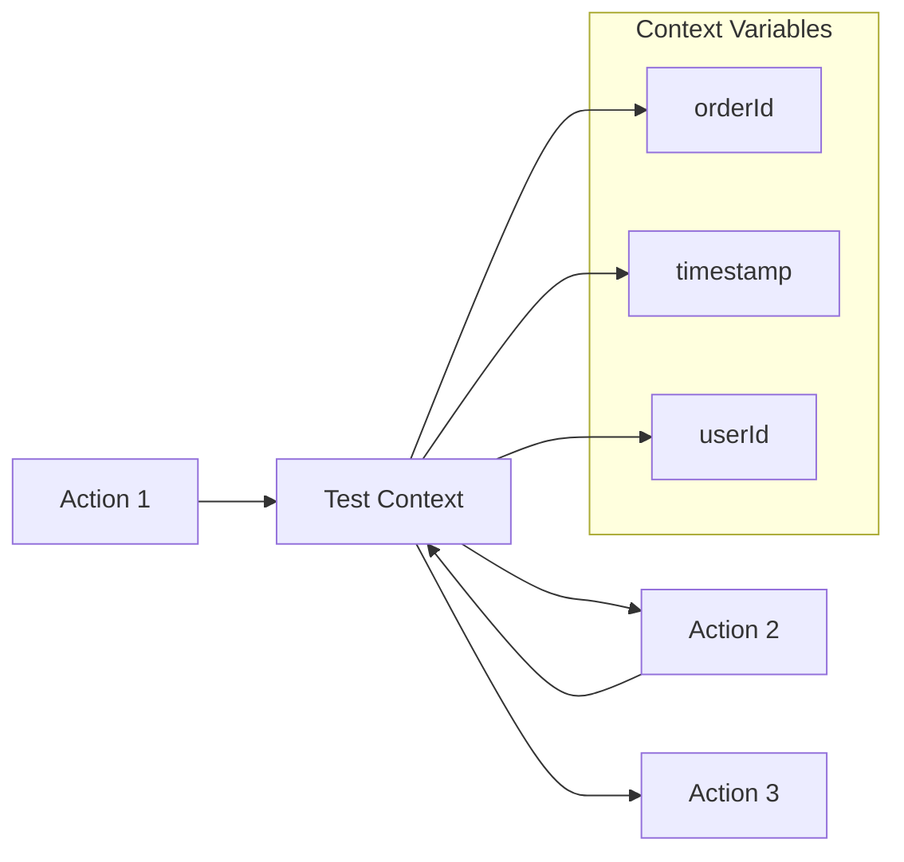

# Test Scenarios Guide

This guide provides comprehensive information about creating, managing, and running test scenarios with the AWS Integration Tests CLI.

## Overview

Test scenarios define the sequence of actions and validations that make up an end-to-end test. They are written in JSON format and stored in the `tests/` directory.

## Scenario Structure

### Basic Template

```json
{
  "scenarioName": "MyTestScenario",
  "description": "Description of what this test validates",
  "metadata": {
    "author": "Test Author",
    "version": "1.0",
    "tags": ["api", "database", "integration"]
  },
  "setup": [],
  "actions": [],
  "assertions": {},
  "cleanup": []
}
```

### Complete Example

```json
{
  "scenarioName": "CompleteOrderProcessingTest",
  "description": "Tests the complete order processing workflow from creation to fulfillment",
  "metadata": {
    "author": "E2E Team",
    "version": "2.1",
    "tags": ["orders", "payment", "fulfillment"],
    "timeout": 300,
    "retries": 3
  },
  "setup": [
    {
      "name": "PrepareTestData",
      "type": "dynamodb_interact",
      "params": {
        "action": "put_item",
        "table_name": "TestData",
        "item": {
          "testId": "{{testRunId}}",
          "status": "prepared"
        }
      }
    }
  ],
  "actions": [
    {
      "name": "CreateOrder",
      "type": "http_call",
      "params": {
        "url": "https://api.example.com/orders",
        "method": "POST",
        "headers": {
          "Content-Type": "application/json",
          "Authorization": "Bearer {{env.API_TOKEN}}"
        },
        "body": {
          "customerId": "12345",
          "items": [
            {
              "productId": "prod-001",
              "quantity": 2
            }
          ],
          "testRunId": "{{testRunId}}"
        },
        "expectedStatusCode": 201
      },
      "passToContext": {
        "orderId": "$.response.body.orderId",
        "orderStatus": "$.response.body.status",
        "totalAmount": "$.response.body.total"
      },
      "assert": {
        "type": "exists",
        "path": "$.response.body.orderId"
      }
    },
    {
      "name": "WaitForProcessing",
      "type": "wait",
      "params": {
        "seconds": 30
      }
    },
    {
      "name": "ValidateOrderInDatabase",
      "type": "dynamodb_interact",
      "params": {
        "action": "get_item",
        "table_name": "Orders",
        "key": {
          "orderId": "{{context.orderId}}"
        }
      },
      "assert": {
        "type": "equals",
        "path": "$.item.status",
        "expected": "processing"
      }
    },
    {
      "name": "ProcessPayment",
      "type": "lambda_invoke",
      "params": {
        "function_name": "payment-processor",
        "payload": {
          "orderId": "{{context.orderId}}",
          "amount": "{{context.totalAmount}}"
        }
      },
      "assert": {
        "type": "equals",
        "path": "$.response.statusCode",
        "expected": 200
      }
    }
  ],
  "assertions": {
    "orderCreated": {
      "type": "exists",
      "path": "$.context.orderId"
    },
    "paymentProcessed": {
      "type": "equals",
      "path": "$.actions[3].result.paymentStatus",
      "expected": "completed"
    }
  },
  "cleanup": [
    {
      "name": "RemoveTestOrder",
      "type": "dynamodb_interact",
      "params": {
        "action": "delete_item",
        "table_name": "Orders",
        "key": {
          "orderId": "{{context.orderId}}"
        }
      }
    }
  ]
}
```

## Action Types

### HTTP Call Actions

HTTP actions perform REST API calls and validate responses.

#### Basic HTTP Call

```json
{
  "name": "GetUserProfile",
  "type": "http_call",
  "params": {
    "url": "https://api.example.com/users/123",
    "method": "GET",
    "headers": {
      "Authorization": "Bearer {{env.ACCESS_TOKEN}}"
    },
    "expectedStatusCode": 200
  }
}
```

#### POST with Dynamic Data

```json
{
  "name": "CreateUser",
  "type": "http_call",
  "params": {
    "url": "https://api.example.com/users",
    "method": "POST",
    "headers": {
      "Content-Type": "application/json"
    },
    "body": {
      "email": "test-{{testRunId}}@example.com",
      "name": "Test User",
      "timestamp": "{{now}}"
    },
    "expectedStatusCode": 201
  },
  "passToContext": {
    "userId": "$.response.body.id",
    "userEmail": "$.response.body.email"
  }
}
```

#### HTTP Call with Retry Logic

```json
{
  "name": "ReliableAPICall",
  "type": "http_call",
  "params": {
    "url": "https://unreliable-api.example.com/data",
    "method": "GET",
    "retry": {
      "maxAttempts": 3,
      "backoffSeconds": 5,
      "retryOn": [500, 502, 503, 504]
    }
  }
}
```

### DynamoDB Actions

DynamoDB actions perform database operations.

#### Get Item

```json
{
  "name": "GetOrder",
  "type": "dynamodb_interact",
  "params": {
    "action": "get_item",
    "table_name": "Orders",
    "key": {
      "orderId": "order-123",
      "timestamp": "2023-07-22T10:30:00Z"
    }
  }
}
```

#### Put Item

```json
{
  "name": "CreateTestRecord",
  "type": "dynamodb_interact",
  "params": {
    "action": "put_item",
    "table_name": "TestData",
    "item": {
      "testId": "{{testRunId}}",
      "status": "active",
      "createdAt": "{{now}}",
      "ttl": "{{now + 3600}}"
    }
  }
}
```

#### Query with Filter

```json
{
  "name": "FindOrdersByStatus",
  "type": "dynamodb_interact",
  "params": {
    "action": "query",
    "table_name": "Orders",
    "index_name": "status-index",
    "key_condition": "status = :status",
    "expression_attribute_values": {
      ":status": "processing"
    },
    "filter_expression": "testRunId = :testId",
    "expression_attribute_values": {
      ":testId": "{{testRunId}}"
    }
  }
}
```

#### Update Item

```json
{
  "name": "UpdateOrderStatus",
  "type": "dynamodb_interact",
  "params": {
    "action": "update_item",
    "table_name": "Orders",
    "key": {
      "orderId": "{{context.orderId}}"
    },
    "update_expression": "SET #status = :status, updatedAt = :timestamp",
    "expression_attribute_names": {
      "#status": "status"
    },
    "expression_attribute_values": {
      ":status": "completed",
      ":timestamp": "{{now}}"
    }
  }
}
```

### Lambda Invocation Actions

Lambda actions invoke AWS Lambda functions.

#### Synchronous Invocation

```json
{
  "name": "ProcessOrder",
  "type": "lambda_invoke",
  "params": {
    "function_name": "order-processor",
    "invocation_type": "RequestResponse",
    "payload": {
      "orderId": "{{context.orderId}}",
      "action": "process",
      "testMode": true
    }
  }
}
```

#### Asynchronous Invocation

```json
{
  "name": "TriggerNotification",
  "type": "lambda_invoke",
  "params": {
    "function_name": "notification-sender",
    "invocation_type": "Event",
    "payload": {
      "type": "order_completed",
      "orderId": "{{context.orderId}}",
      "userId": "{{context.userId}}"
    }
  }
}
```

### Wait Actions

Wait actions introduce delays in test execution.

#### Simple Wait

```json
{
  "name": "WaitForProcessing",
  "type": "wait",
  "params": {
    "seconds": 30
  }
}
```

#### Conditional Wait

```json
{
  "name": "WaitForStatus",
  "type": "wait",
  "params": {
    "condition": {
      "type": "dynamodb_item_exists",
      "table_name": "Orders",
      "key": {
        "orderId": "{{context.orderId}}"
      },
      "attribute_condition": "attribute_exists(processedAt)"
    },
    "maxWaitSeconds": 120,
    "pollIntervalSeconds": 10
  }
}
```

## Context and Variable Management

### Context Data Flow



### Variable Types

#### Built-in Variables

| Variable | Description | Example |
|----------|-------------|---------|
| `{{testRunId}}` | Unique test execution ID | `12345678-1234-1234-1234-123456789012` |
| `{{now}}` | Current timestamp | `2023-07-22T10:30:00Z` |
| `{{now + 3600}}` | Future timestamp (seconds offset) | `2023-07-22T11:30:00Z` |
| `{{random}}` | Random UUID | `87654321-4321-4321-4321-210987654321` |

#### Environment Variables

```json
{
  "headers": {
    "Authorization": "Bearer {{env.API_TOKEN}}",
    "X-Environment": "{{env.TEST_ENVIRONMENT}}"
  }
}
```

#### Context Variables

```json
{
  "params": {
    "orderId": "{{context.orderId}}",
    "userId": "{{context.userId}}"
  }
}
```

### JSONPath Expressions

Use JSONPath to extract data from responses:

```json
{
  "passToContext": {
    "orderId": "$.response.body.order.id",
    "items": "$.response.body.order.items[*].productId",
    "firstItemName": "$.response.body.order.items[0].name",
    "totalCount": "$.response.body.pagination.total"
  }
}
```

## Assertions and Validations

### Assertion Types

#### Equals Assertion

```json
{
  "assert": {
    "type": "equals",
    "path": "$.response.status",
    "expected": "success"
  }
}
```

#### Not Equals Assertion

```json
{
  "assert": {
    "type": "not_equals",
    "path": "$.response.error",
    "expected": null
  }
}
```

#### Contains Assertion

```json
{
  "assert": {
    "type": "contains",
    "path": "$.response.tags",
    "expected": "production"
  }
}
```

#### Exists Assertion

```json
{
  "assert": {
    "type": "exists",
    "path": "$.response.body.orderId"
  }
}
```

#### Greater Than Assertion

```json
{
  "assert": {
    "type": "greater_than",
    "path": "$.response.body.total",
    "expected": 0
  }
}
```

#### Less Than Assertion

```json
{
  "assert": {
    "type": "less_than",
    "path": "$.response.body.processingTime",
    "expected": 5000
  }
}
```

#### Complex Assertion

```json
{
  "assert": {
    "type": "and",
    "conditions": [
      {
        "type": "exists",
        "path": "$.response.body.orderId"
      },
      {
        "type": "equals",
        "path": "$.response.body.status",
        "expected": "created"
      },
      {
        "type": "greater_than",
        "path": "$.response.body.items.length",
        "expected": 0
      }
    ]
  }
}
```

### Global Assertions

Define assertions that run after all actions complete:

```json
{
  "assertions": {
    "orderProcessed": {
      "description": "Verify order was processed successfully",
      "type": "equals",
      "path": "$.context.orderStatus",
      "expected": "completed"
    },
    "paymentValid": {
      "description": "Verify payment was processed",
      "type": "exists",
      "path": "$.context.paymentId"
    }
  }
}
```

## Advanced Patterns

### Parallel Actions

Execute multiple actions concurrently:

```json
{
  "name": "ParallelValidation",
  "type": "parallel",
  "branches": [
    {
      "name": "ValidateAPI",
      "type": "http_call",
      "params": {
        "url": "https://api1.example.com/status",
        "method": "GET"
      }
    },
    {
      "name": "ValidateDatabase",
      "type": "dynamodb_interact",
      "params": {
        "action": "get_item",
        "table_name": "Status",
        "key": {"service": "api1"}
      }
    }
  ]
}
```

### Conditional Actions

Execute actions based on conditions:

```json
{
  "name": "ConditionalProcessing",
  "type": "choice",
  "condition": {
    "type": "equals",
    "path": "$.context.orderType",
    "expected": "premium"
  },
  "if_true": {
    "name": "ProcessPremiumOrder",
    "type": "lambda_invoke",
    "params": {
      "function_name": "premium-processor"
    }
  },
  "if_false": {
    "name": "ProcessStandardOrder",
    "type": "lambda_invoke",
    "params": {
      "function_name": "standard-processor"
    }
  }
}
```

### Loop Actions

Repeat actions until a condition is met:

```json
{
  "name": "WaitForCompletion",
  "type": "loop",
  "max_iterations": 10,
  "condition": {
    "type": "not_equals",
    "path": "$.context.status",
    "expected": "completed"
  },
  "actions": [
    {
      "name": "CheckStatus",
      "type": "http_call",
      "params": {
        "url": "https://api.example.com/orders/{{context.orderId}}/status",
        "method": "GET"
      }
    },
    {
      "name": "WaitBetweenChecks",
      "type": "wait",
      "params": {
        "seconds": 5
      }
    }
  ]
}
```

## Best Practices

### 1. Scenario Organization

```
tests/
├── api/
│   ├── user_creation_success.json
│   ├── user_creation_failure.json
│   └── user_authentication.json
├── database/
│   ├── data_consistency.json
│   └── performance.json
├── integration/
│   ├── order_fulfillment_e2e.json
│   └── payment_processing_e2e.json
└── smoke/
    ├── health_check.json
    └── basic_functionality.json
```

### 2. Naming Conventions

- **Scenarios**: `<feature>_<condition>_<expected_result>.json`
- **Actions**: Use descriptive names that indicate purpose
- **Context variables**: Use camelCase for consistency

### 3. Error Handling

```json
{
  "name": "RobustAPICall",
  "type": "http_call",
  "params": {
    "url": "https://api.example.com/data",
    "method": "GET",
    "retry": {
      "maxAttempts": 3,
      "backoffSeconds": 2
    }
  },
  "on_failure": {
    "name": "LogFailure",
    "type": "lambda_invoke",
    "params": {
      "function_name": "error-logger",
      "payload": {
        "testRunId": "{{testRunId}}",
        "action": "RobustAPICall",
        "error": "{{error}}"
      }
    }
  }
}
```

### 4. Data Isolation

Use unique identifiers to avoid test interference:

```json
{
  "body": {
    "email": "test-{{testRunId}}@example.com",
    "username": "user_{{random}}",
    "testContext": "{{testRunId}}"
  }
}
```

### 5. Resource Cleanup

Always include cleanup actions:

```json
{
  "cleanup": [
    {
      "name": "RemoveTestData",
      "type": "dynamodb_interact",
      "params": {
        "action": "delete_item",
        "table_name": "TestData",
        "key": {
          "testId": "{{testRunId}}"
        }
      }
    }
  ]
}
```

## Scenario Validation

### JSON Schema Validation

Validate your scenarios against the schema:

```bash
# Install JSON schema validator
pip install jsonschema

# Validate scenario
python -m jsonschema -i tests/my_scenario.json schemas/scenario_schema.json
```

### Dry Run Mode

Test scenario syntax without execution:

```bash
python cli.py validate tests/my_scenario.json
```

## Troubleshooting

### Common Issues

1. **Variable Resolution Failures**
   - Check variable syntax: `{{variable}}` not `{variable}`
   - Verify context variable names match `passToContext` definitions

2. **JSONPath Expression Errors**
   - Test expressions with online JSONPath evaluators
   - Ensure paths match actual response structure

3. **Assertion Failures**
   - Use `exists` assertions before `equals` for optional fields
   - Check data types in comparisons

4. **Timeout Issues**
   - Increase wait times for slow operations
   - Use conditional waits instead of fixed delays

This comprehensive guide covers all aspects of creating effective test scenarios with the AWS Integration Tests CLI. Continue exploring the [API Reference](API_REFERENCE.md) for detailed parameter specifications.
